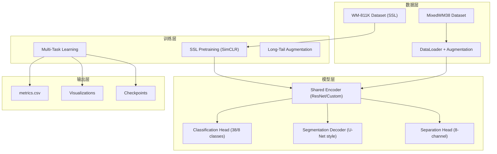
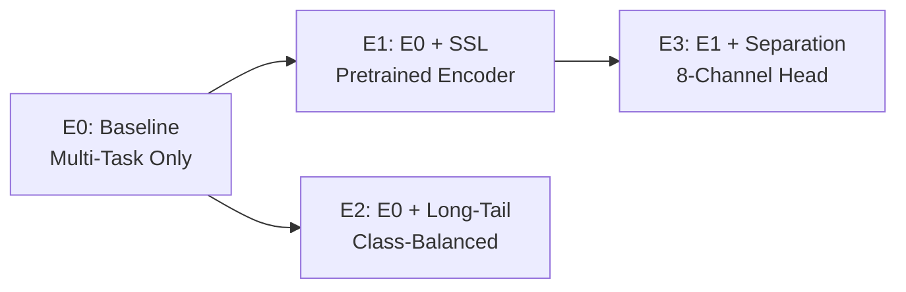

# Design Document: MixedWM38 混合缺陷晶圆图谱多任务识别系统

## Overview

本系统是一个面向晶圆工艺场景的多任务深度学习系统，支持三个核心任务：
- **T1 分类**：38类单标签分类 + 8类基础缺陷多标签分类
- **T2 分割**：二值缺陷定位分割
- **T3 分离**：8通道弱监督成分分离（针对混合缺陷）

系统采用渐进式实验设计（E0→E3），基于 PyTorch 实现，支持 AMP 混合精度训练和断点续训。

## Architecture

### 系统架构图



### 实验组架构



## Components and Interfaces

### 1. 配置管理模块 (configs/)

```yaml
# configs/e0.yaml 示例结构
experiment:
  name: "e0_baseline"
  seed: 42
  debug: false  # debug模式：每类少量样本

data:
  dataset: "MixedWM38"
  data_root: "data/processed"
  image_size: [224, 224]
  batch_size: 32
  num_workers: 4
  classification_mode: "single_label"  # single_label | multi_label
  augmentation:
    wafer_friendly: true
    rotation: [0, 90, 180, 270]
    flip: true
    morphological_noise: 0.1

model:
  encoder: "custom"  # custom | resnet18 | resnet34
  pretrained_weights: null  # SSL checkpoint path
  classification_classes: 38
  segmentation_classes: 1
  separation_enabled: false
  separation_channels: 8

training:
  epochs: 100
  optimizer: "adamw"
  learning_rate: 0.001
  weight_decay: 0.01
  scheduler: "cosine"
  amp_enabled: true
  checkpoint_metric: "macro_f1"  # 可配置的最佳模型指标
  
loss:
  classification: "cross_entropy"
  segmentation: "bce_dice"
  separation: "kl_divergence"
  weights: [1.0, 1.0, 0.5]

output:
  results_dir: "results"
  save_every: 10
```

### 2. 数据模块 (src/data/)

#### 2.1 数据集类

```python
class MixedWM38Dataset(Dataset):
    """MixedWM38 数据集加载器
    
    支持:
    - 38类单标签分类
    - 8类多标签分类（从38类映射构造）
    - 二值分割mask
    - 伪mask生成（当真实mask不可用时）
    """
    
    def __init__(self, 
                 data_root: str,
                 split: str,  # train | val | test
                 classification_mode: str,  # single_label | multi_label
                 transform: Optional[Callable] = None,
                 pseudo_mask_config: Optional[dict] = None):
        ...
    
    def __getitem__(self, idx) -> Dict[str, Tensor]:
        """返回: {image, mask, label_38, label_8}"""
        ...
```

#### 2.2 38类到8类映射

```python
# 8类基础缺陷: Center, Donut, EL, ER, LOC, NF, S, Random
LABEL_38_TO_8_MAPPING = {
    0: [0,0,0,0,0,0,0,0],  # Normal
    1: [1,0,0,0,0,0,0,0],  # Center
    2: [0,1,0,0,0,0,0,0],  # Donut
    # ... 混合类别为多个1
    9: [1,0,1,0,0,0,0,0],  # C+EL
    # ...
}
```

#### 2.3 伪Mask生成

当真实分割mask不可用时，系统自动触发伪mask生成：

```python
class PseudoMaskGenerator:
    """伪Mask生成器
    
    触发条件: mask文件不存在或为空
    """
    def __init__(self, config: dict):
        self.threshold = config.get('threshold', 128)
        self.morphology_kernel = config.get('morphology_kernel', 3)
        self.min_area = config.get('min_area', 100)
    
    def generate(self, image: np.ndarray) -> np.ndarray:
        """基于阈值和形态学操作生成伪mask"""
        ...
```

**伪Mask触发时的行为**:
1. 记录生成参数到 `config_snapshot.yaml` 的 `pseudo_mask` 字段
2. 导出至少10张overlay样例到 `results/<exp>/pseudo_mask_samples/`
3. 在日志中记录伪mask使用统计

#### 2.4 数据增强

```python
class WaferFriendlyAugmentation:
    """晶圆友好的数据增强
    
    白名单操作: rotation, flip, morphological_noise, color_jitter
    黑名单操作: RandomResizedCrop, CenterCrop, 大于20%的裁剪
    """
    def __init__(self, config: dict):
        self.rotation_angles = config.get('rotation', [0, 90, 180, 270])
        self.flip = config.get('flip', True)
        self.morphological_noise = config.get('morphological_noise', 0.1)
        
    def validate_config(self) -> bool:
        """验证增强配置不包含黑名单操作"""
        ...
```

### 3. 模型模块 (src/models/)

#### 3.1 编码器

```python
class WaferEncoder(nn.Module):
    """共享特征编码器
    
    支持:
    - 自定义轻量级架构（原有设计）
    - ResNet backbone
    - SSL预训练权重加载
    """
    
    def load_pretrained(self, 
                        checkpoint_path: str,
                        key_mapping: Optional[Dict] = None) -> Dict[str, int]:
        """加载预训练权重，支持可配置的key映射
        
        Args:
            checkpoint_path: SSL检查点路径
            key_mapping: 可选的key映射规则
                - strip_prefix: 要剥离的前缀列表 (e.g., ["encoder.", "backbone."])
                - extract_subtree: 要提取的子树 (e.g., "encoder")
        
        Returns:
            {
                matched: int,           # 成功匹配的key数
                missing: int,           # 目标模型缺失的key数
                unexpected: int,        # checkpoint中多余的key数
                shape_mismatch: int,    # 形状不匹配的key数
                ignored_prefixes: List[str]  # 被忽略的前缀
            }
        
        Side Effects:
            - 将映射规则和统计写入 results/<exp>/weight_loading.json
        """
        ...
```

#### 3.2 多任务模型

```python
class WaferMultiTaskModel(nn.Module):
    """多任务模型
    
    包含:
    - 共享编码器
    - 分类头 (38类/8类)
    - 分割解码器 (U-Net style)
    - 分离头 (8通道, E3专用)
    """
    
    def forward(self, x: Tensor) -> Dict[str, Tensor]:
        """
        Returns:
            {
                'cls_logits': Tensor,      # [B, 38] or [B, 8]
                'seg_mask': Tensor,        # [B, 1, H, W]
                'sep_heatmaps': Tensor,    # [B, 8, H, W] (if enabled)
            }
        """
        ...
```

#### 3.3 损失函数

```python
class MultiTaskLoss(nn.Module):
    """多任务损失函数
    
    支持:
    - CrossEntropy / FocalLoss / ClassBalancedLoss (分类)
    - BCE + Dice (分割)
    - KL Divergence (分离)
    - Class-balanced weighting
    """
    ...
```

### 4. 训练模块 (src/training/)

#### 4.1 训练器

```python
class Trainer:
    """统一训练器
    
    功能:
    - AMP混合精度
    - 断点续训
    - 最佳模型保存（可配置指标）
    - 训练曲线记录
    """
    
    def train(self, resume_from: Optional[str] = None):
        ...
    
    def save_checkpoint(self, path: str, is_best: bool = False):
        """保存检查点，包含完整训练状态"""
        ...
    
    def load_checkpoint(self, path: str) -> Dict:
        """加载检查点，返回训练状态"""
        ...
```

#### 4.2 SSL预训练

```python
class SimCLRTrainer:
    """SimCLR风格的自监督预训练
    
    用于WM-811K数据集
    """
    ...
```

### 5. 评估模块 (src/evaluation/)

```python
class Evaluator:
    """统一评估器
    
    输出:
    - metrics.csv (Macro-F1, Dice, IoU, mAP)
    - confusion_matrix.png
    - seg_overlays/
    - separation_maps/ (E3)
    - curves/
    """
    
    def evaluate(self, model, dataloader, output_dir: str):
        ...
    
    def generate_comparison_table(self, exp_dirs: List[str], output_path: str):
        """生成 results/comparison.csv"""
        ...
```

### 6. 可视化模块 (src/visualization/)

```python
class Visualizer:
    """可视化工具
    
    生成:
    - 混淆矩阵
    - 分割overlay
    - 8通道分离热力图
    - 训练曲线
    """
    ...
```

## Data Models

### 配置数据结构

```python
@dataclass
class ExperimentConfig:
    name: str
    seed: int
    debug: bool
    data: DataConfig
    model: ModelConfig
    training: TrainingConfig
    loss: LossConfig
    output: OutputConfig

@dataclass
class DataConfig:
    dataset: str
    data_root: str
    image_size: Tuple[int, int]
    batch_size: int
    num_workers: int
    classification_mode: str
    augmentation: AugmentationConfig

@dataclass
class ModelConfig:
    encoder: str
    pretrained_weights: Optional[str]
    classification_classes: int
    segmentation_classes: int
    separation_enabled: bool
    separation_channels: int
```

### 输出数据结构

```
results/<exp_name>/
├── metrics.csv              # 所有指标，含per-class breakdown
├── confusion_matrix.png     # 分类混淆矩阵
├── meta.json                # 可复现元信息 {git_commit, seed, timestamp}
├── config_snapshot.yaml     # 配置副本（含pseudo_mask参数如适用）
├── weight_loading.json      # SSL权重加载统计（E1/E3）
├── seg_overlays/            # 分割可视化
│   ├── sample_001.png
│   └── ...
├── separation_maps/         # E3专用，8通道热力图
│   ├── sample_001.png
│   ├── sample_001.pt        # 原始tensor
│   └── ...
├── curves/
│   ├── loss_curve.png
│   └── metric_curve.png
├── checkpoints/
│   ├── best.pt
│   └── last.pt
└── pseudo_mask_samples/     # 伪mask样例（如适用，至少10张）
    ├── sample_001_overlay.png
    └── ...

results/
├── comparison.csv           # E0/E1/E2/E3对比表
└── tail_class_analysis.csv  # 尾部类别分析（E2）
```

## Correctness Properties

*A property is a characteristic or behavior that should hold true across all valid executions of a system-essentially, a formal statement about what the system should do. Properties serve as the bridge between human-readable specifications and machine-verifiable correctness guarantees.*

### Property 1: 38类到8类标签映射正确性
*For any* 38类标签：
- 若为单缺陷类（1-8），映射结果应为one-hot向量，且hot位置对应正确的缺陷类型
- 若为混合缺陷类（9-37），映射结果应为multi-hot向量，包含所有组成成分的hot位

映射权威来源: `src/data/mappings.py`（包含LABEL_38_TO_8字典和验证函数）

系统应在数据加载时打印映射覆盖率统计（38类中有多少被正确映射），并记录到日志和报告。

**Validates: Requirements 2.2, 2.3**

### Property 2: 分割mask二值性
*For any* 加载的分割mask，其像素值应仅包含0和1两种值，且mask尺寸应与输入图像尺寸一致。

**Validates: Requirements 2.4**

### Property 3: 数据增强白名单/黑名单合规性
*For any* 数据增强pipeline配置，应仅包含白名单操作（rotation、flip、morphological_noise、color_jitter），且不包含黑名单操作（RandomResizedCrop、CenterCrop、大于20%的裁剪）。

**Validates: Requirements 2.6, 4.5**

### Property 4: 检查点保存与恢复一致性
*For any* 保存的训练检查点，加载后恢复的模型权重、优化器状态和训练epoch应与保存时完全一致。

**Validates: Requirements 3.4**

### Property 5: 评估指标输出完整性
*For any* 完成的评估运行，metrics.csv应包含Macro-F1、Dice、IoU指标；若启用多标签模式，还应包含mAP指标。

**Validates: Requirements 3.5**

### Property 6: SSL权重加载诊断完整性
*For any* SSL预训练权重加载操作，系统应输出完整的诊断统计：matched、missing、unexpected、shape_mismatch、ignored_prefixes，且统计字段完整可解释（不强制要求计数等式）。

**Validates: Requirements 4.2, 4.3**

### Property 7: 分离头输出通道数
*For any* E3模型的前向传播，分离头输出应为8通道张量，每个通道对应一种基础缺陷类型。

**Validates: Requirements 6.1**

### Property 8: 实验输出结构完整性
*For any* 完成的实验，results/<exp_name>/目录应包含：metrics.csv、confusion_matrix.png、config_snapshot.yaml、meta.json、curves/目录，且config_snapshot.yaml内容应与输入配置一致，meta.json应包含git_commit和seed字段。

**Validates: Requirements 7.2, 7.3, 7.4**

### Property 9: 配置文件YAML格式有效性
*For any* configs/目录下的配置文件，应能被YAML解析器正确解析，且包含所有必需字段。

**Validates: Requirements 2.7**

## Error Handling

### 数据加载错误

| 错误类型 | 处理策略 |
|---------|---------|
| 数据文件不存在 | 抛出FileNotFoundError，提示数据准备步骤 |
| Mask文件缺失 | 自动生成伪mask，记录到config_snapshot |
| 标签格式错误 | 抛出ValueError，显示期望格式 |

### 训练错误

| 错误类型 | 处理策略 |
|---------|---------|
| CUDA OOM | **报错并停止**，提示用户调整参数（batch_size/image_size/amp/grad_accum_steps），不自动降低以保证可复现性 |
| NaN Loss | 停止训练，保存当前状态，提示检查学习率 |
| 检查点损坏 | 尝试加载备份，失败则从头训练 |

### 显存不足的可复现解决方案

使用梯度累积代替自动降batch_size：

```yaml
training:
  batch_size: 32
  grad_accum_steps: 2  # 等效batch_size=64，但显存占用为32
```

`grad_accum_steps`会被记录到`config_snapshot.yaml`，确保可复现。

### 权重加载错误

| 错误类型 | 处理策略 |
|---------|---------|
| Key不匹配 | 使用strict=False，记录missing/unexpected keys |
| 形状不匹配 | 跳过该层，记录警告 |

## Docs & Deliverables Module

### 目录结构

```
report/
└── REPORT.md              # 中文实验报告（自动从results汇总）

slides/
├── SLIDES.md              # 10-12页PPT的Markdown大纲
└── final.pptx             # 生成的PPT文件（可选）

docs/
├── SETUP_WINDOWS.md       # Windows环境搭建指南
├── LEARNER_GUIDE.md       # 新手教学+排错+概念小抄
└── BUILD_PPT.md           # PPT生成说明
```

### 脚本接口规范

#### 1. generate_report.py - 实验报告生成

```bash
python scripts/generate_report.py \
    --results_root results \
    --out report/REPORT.md
```

**输入**:
- `results/` 目录下所有实验结果（metrics.csv, confusion_matrix.png等）
- `results/comparison.csv`（实验对比表）

**输出**:
- `report/REPORT.md` 包含：摘要、背景、方法、结果表格、图片引用、结论

**示例输出结构**:
```markdown
# 实验报告：MixedWM38混合缺陷晶圆图谱多任务识别

## 摘要
...

## 实验结果
| 实验 | Macro-F1 | Dice | IoU | Delta vs E0 |
|------|----------|------|-----|-------------|
| E0   | 0.xx     | 0.xx | 0.xx| -           |
| E1   | 0.xx     | 0.xx | 0.xx| +x.x%       |


```

#### 2. generate_slides_md.py - PPT大纲生成

```bash
python scripts/generate_slides_md.py \
    --results_root results \
    --out slides/SLIDES.md
```

**输入**: 同上

**输出**: `slides/SLIDES.md` 包含10-12页结构：
1. 封面
2. 问题定义
3. 数据集介绍
4. 方法框图
5. E0基线结果
6. E1 SSL对比
7. E2长尾增强（如有）
8. E3成分分离（如有）
9. 关键可视化（混淆矩阵/overlay/热力图）
10. 消融实验总结
11. 结论与展望
12. Q&A

#### 3. build_pptx.py - PPT文件生成

```bash
python scripts/build_pptx.py \
    --slides_md slides/SLIDES.md \
    --results_root results \
    --out slides/final.pptx
```

**依赖**: `python-pptx`

**输入**:
- `slides/SLIDES.md`（大纲）
- `results/` 目录下的图片文件

**输出**: `slides/final.pptx`

**降级方案**: 若pptx生成失败，确保SLIDES.md完整且包含所有图表的相对路径引用。

### LEARNER_GUIDE.md 内容规范

```markdown
# 新手学习指南

## 1. 快速开始命令清单
- 环境安装: `conda env create -f environment.yml`
- 数据准备: `python src/data/make_dataset.py`
- Debug训练: `python train.py --config configs/e0.yaml --debug`
- 完整训练: `python train.py --config configs/e0.yaml`
- 评估: `python eval.py --config configs/e0.yaml --ckpt results/e0/checkpoints/best.pt`

## 2. 常见报错排查

### CUDA相关
- `CUDA out of memory`: 降低batch_size或image_size，启用AMP，使用grad_accum_steps
- `CUDA not available`: 检查PyTorch CUDA版本与驱动匹配

### 依赖相关
- `ModuleNotFoundError`: 检查conda环境是否激活
- `版本冲突`: 使用requirements.txt固定版本

### 路径相关
- `FileNotFoundError`: 检查data_root配置，确认数据已准备

### 显存不足排查步骤
1. 检查当前batch_size（建议从16开始）
2. 启用AMP: `training.amp_enabled: true`
3. 使用梯度累积: `training.grad_accum_steps: 2`
4. 降低image_size: `data.image_size: [128, 128]`

## 3. 关键概念小抄

### Macro-F1
各类别F1分数的算术平均，对类别不平衡敏感。
公式: Macro-F1 = (1/N) * Σ F1_i

### Dice系数
分割任务的重叠度指标。
公式: Dice = 2|A∩B| / (|A|+|B|)

### 对比学习(Contrastive Learning)
通过拉近相似样本、推远不相似样本来学习表征。
本项目使用SimCLR风格的自监督预训练。

### 长尾分布(Long-Tail)
少数类别样本数远少于多数类别。
解决方案: 类均衡采样、Focal Loss、过采样。

### 弱监督(Weak Supervision)
使用不完整或噪声标签进行训练。
本项目E3使用图像级标签生成像素级分离热力图。

## 4. 如何判断过拟合
- train_loss持续下降但val_loss上升
- train_macro_f1远高于val_macro_f1
- 混淆矩阵显示某些类别完全错分
```

## E2 Long-Tail Design (最小实现)

### 核心策略

E2采用三管齐下的长尾处理策略：

1. **WeightedRandomSampler**: 按类别频率倒数加权采样
2. **Strong Augmentation**: 对尾部类别应用更强的增强
3. **Focal/Class-Balanced Loss**: 降低易分类样本的损失权重

### 配置示例

```yaml
# configs/e2.yaml
data:
  sampler: "weighted"  # uniform | weighted | sqrt_weighted
  tail_class_threshold: 100  # 样本数少于此值的类为尾部类
  tail_augmentation_strength: 2.0  # 尾部类增强强度倍数

loss:
  classification: "focal"  # cross_entropy | focal | class_balanced
  focal_gamma: 2.0
  focal_alpha: null  # null表示自动计算
  class_balanced_beta: 0.9999
```

### 实现接口

```python
class WeightedClassSampler(Sampler):
    """按类别频率加权的采样器"""
    def __init__(self, labels: List[int], mode: str = "inverse"):
        # mode: inverse | sqrt_inverse | effective_num
        ...

class FocalLoss(nn.Module):
    """Focal Loss for class imbalance"""
    def __init__(self, gamma: float = 2.0, alpha: Optional[Tensor] = None):
        ...

class ClassBalancedLoss(nn.Module):
    """Class-Balanced Loss based on effective number of samples"""
    def __init__(self, beta: float = 0.9999, num_per_class: List[int]):
        ...
```

### 输出要求

E2的`comparison.csv`需额外包含尾部类别的per-class delta：

```csv
exp,macro_f1,dice,iou,tail_macro_f1,tail_delta_vs_e0
e0,0.75,0.82,0.70,0.45,-
e2,0.78,0.83,0.71,0.58,+28.9%
```

或单独输出`results/tail_class_analysis.csv`：

```csv
class_id,class_name,sample_count,e0_f1,e2_f1,delta
34,C+L+EL+S,15,0.32,0.51,+59.4%
35,C+L+ER+S,12,0.28,0.45,+60.7%
...
```

## E3 Separation Design (两条路径)

### E3-Fallback（默认路径）

不训练分离头，使用prototype相似度方法：

1. **Prototype构建**:
   - 从训练集中提取所有单缺陷类样本（class 1-8）
   - 对每类样本通过encoder提取feature map
   - 计算每类的prototype: `prototype_i = mean(features_class_i)`

2. **相似度计算**:
   - 对输入图像提取feature map: `F ∈ R^{C×H×W}`
   - 对每个prototype计算cosine similarity: `sim_i = cosine(F, prototype_i)`
   - 输出8通道热力图: `separation_maps ∈ R^{8×H×W}`

3. **输出格式**:
   - 图片: `results/<exp>/separation_maps/sample_xxx.png`（8通道可视化）
   - 数据: `results/<exp>/separation_maps/sample_xxx.pt`（原始tensor）

4. **配置开关**:
```yaml
model:
  separation_enabled: true
  separation_mode: "prototype"  # prototype | trained
```

### E3-Optional（可选训练路径）

若实现弱监督训练：

1. **Soft Target构造**:
   - 使用prototype相似度作为soft target
   - `target_i = softmax(sim_i / temperature)`

2. **损失函数**:
   - KL Divergence: `L_sep = KL(pred_heatmap || soft_target)`
   - 总损失: `L = L_cls + L_seg + λ * L_sep`

3. **配置开关**:
```yaml
model:
  separation_mode: "trained"
loss:
  separation: "kl_divergence"
  separation_weight: 0.5
  separation_temperature: 0.1
```

### 交付保证

无论使用哪条路径，都必须：
- 输出8通道热力图到`separation_maps/`
- 在报告中解释方法与限制
- 在config_snapshot.yaml中记录使用的模式

## Debug Mode Design

### 触发方式

```bash
# 命令行参数
python train.py --config configs/e0.yaml --debug

# 或配置文件
experiment:
  debug: true
```

### Debug模式策略

| 参数 | 正常模式 | Debug模式 |
|------|---------|----------|
| 每类样本数 | 全部 | max(5, 1%) |
| 总样本上限 | 无 | 500 |
| epochs | 100 | 2 |
| num_workers | 4 | 0 |
| batch_size | 32 | 8 |
| 实验范围 | E0-E3 | 仅E0 |
| 分离头 | 按配置 | 禁用 |
| 扩散增强 | 按配置 | 禁用 |

### 预期完成时间

- RTX 4070 SUPER: < 5分钟
- 包含: 数据加载 + 训练 + 评估 + 输出生成

## Metrics Specification

### 指标计算口径

| 指标 | 适用场景 | 计算方式 | 实现库 |
|------|---------|---------|--------|
| Macro-F1 | 38类/8类分类 | 各类F1算术平均 | sklearn.metrics.f1_score(average='macro') |
| mAP | 仅multi-label | macro平均AP | sklearn.metrics.average_precision_score |
| Dice | 分割 | 2*TP/(2*TP+FP+FN) | 自定义实现 |
| IoU | 分割 | TP/(TP+FP+FN) | 自定义实现 |

### Best Checkpoint选择

```yaml
training:
  checkpoint_metric: "macro_f1"  # 支持: macro_f1 | dice | weighted_sum
  checkpoint_metric_weights:     # 仅weighted_sum时使用
    macro_f1: 0.6
    dice: 0.4
```

## Verification Checklist

### 1. Debug模式验证（预期5分钟内完成）

```bash
# 运行
python train.py --config configs/e0.yaml --debug

# 验证产物
results/e0_debug/
├── metrics.csv          # 应包含Macro-F1, Dice, IoU
├── confusion_matrix.png # 应生成
├── config_snapshot.yaml # 应包含debug=true
└── curves/              # 应包含loss_curve.png
```

### 2. E0完整训练验证

```bash
# 运行
python train.py --config configs/e0.yaml
python eval.py --config configs/e0.yaml --ckpt results/e0/checkpoints/best.pt

# 验证产物
results/e0/
├── metrics.csv
├── confusion_matrix.png
├── seg_overlays/        # 至少10张样例
├── curves/
├── config_snapshot.yaml
└── checkpoints/
    ├── best.pt
    └── last.pt
```

### 3. E1 SSL预训练验证

```bash
# SSL预训练（可选，可使用预训练权重）
python train_ssl.py --config configs/ssl.yaml

# E1训练
python train.py --config configs/e1.yaml
python eval.py --config configs/e1.yaml --ckpt results/e1/checkpoints/best.pt

# 验证
# - 日志应包含权重加载统计: matched=xx, missing=xx, unexpected=xx
# - results/e1/metrics.csv 应与E0可对比
```

### 4. 报告与PPT生成验证

```bash
# 生成对比表
python scripts/generate_comparison.py --results_root results --out results/comparison.csv

# 生成报告
python scripts/generate_report.py --results_root results --out report/REPORT.md

# 生成PPT大纲
python scripts/generate_slides_md.py --results_root results --out slides/SLIDES.md

# 生成PPT文件（可选）
python scripts/build_pptx.py --slides_md slides/SLIDES.md --results_root results --out slides/final.pptx

# 验证
# - report/REPORT.md 应包含所有实验结果表格和图片引用
# - slides/SLIDES.md 应包含10-12页结构
```

### 5. 统一入口验证

所有训练/评估命令应遵循：
```bash
python train.py --config configs/<exp>.yaml [--debug] [--resume path/to/ckpt]
python eval.py --config configs/<exp>.yaml --ckpt path/to/best.pt
```

## Testing Strategy

### 测试框架选择

- **单元测试**: pytest
- **属性测试**: hypothesis (Python PBT库)
- **集成测试**: pytest + fixtures

### 单元测试覆盖

1. **数据模块**
   - 数据集加载正确性
   - 38→8类映射正确性
   - 增强函数输出形状

2. **模型模块**
   - 前向传播输出形状
   - 损失函数计算正确性
   - 权重加载功能

3. **训练模块**
   - 检查点保存/加载
   - AMP训练稳定性

4. **评估模块**
   - 指标计算正确性
   - 输出文件生成

### 属性测试策略

每个属性测试应：
- 使用hypothesis生成随机输入
- 运行至少100次迭代
- 标注对应的Correctness Property编号

```python
# 示例：Property 1 测试
from hypothesis import given, strategies as st

@given(label_38=st.integers(min_value=0, max_value=37))
def test_label_mapping_consistency(label_38):
    """
    **Feature: mixed-wm38-recognition, Property 1: 38类到8类标签映射一致性**
    **Validates: Requirements 2.2, 2.3**
    """
    label_8 = map_38_to_8(label_38)
    reconstructed = reconstruct_from_8(label_8)
    assert label_38 in reconstructed or is_subset(label_38, reconstructed)
```

### 测试配置

```yaml
# pytest.ini
[pytest]
testpaths = tests
python_files = test_*.py
python_functions = test_*
addopts = -v --tb=short
markers =
    property: Property-based tests
    unit: Unit tests
    integration: Integration tests
```
